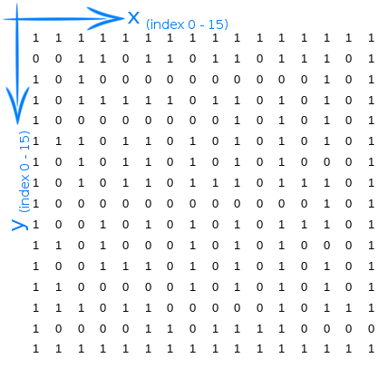

# Maze Runner - Configuration #

&nbsp;

## Introduction ##
This part of the repository contains all files needed to create a configuration.

A configuration consists of one or more levels (i.e. stages) that the player has to pass through. The stages are objects of the class `Maze` and each stage consists of a `KeyBoard` object (i.e. keyboard) that adds some functionality to the buttons on the PewPew board, a maze, a (maze) runner and two or more obstacles.

The aim of the game is to find a way through the maze and to overcome all the obstacles.

&nbsp;

## Code Structure ##
The Python modules in the config folder reflect the logical structure of a configuration described above:

* _demo\_config.py_: This module creates an instance of the `Configuration` class and adds all levels (i.e. stages) in order (i.e. from easy to hard) to the game configuration using the `add( ... )` method.

* _stage\_0.py_: This file contains the easiest level and consists of a simple 8x8 maze with only one maze entry and one maze exit.

* _stage\_1.py_: This script configures the second level of the game. Two additional obstacles are added to the simple 8x8 maze from Stage 0 - a key that has to be found first to be able to open the locked door.

* _stage\_2.py_: This module creates the third level and consists of a 16x16 maze without any additional obstacles (i.e. only the mandatory maze entry and exit obstacles). This configuration should demonstrate which part of the 16x16 maze is displayed on the 8x8 LED screen of the PewPew board when 'walking' through the maze.

* _stage\_3.py_: This script describes the fourth stage of the game, using the same maze as in Stage 2 with four additional obstacles - two keys and two locked doors.

* _stage\_4.py_: The last and most difficult level consists of a 16x16 maze and various obstacles. This is to show that even more complex obstacles like 'teleportation' and mini games (i.e. small games that have to be won to pass) can be integrated into a maze.

* _snake\_minigame.py_: This module implements the mini game used in Stage 4. Basically, it is an object-oriented copy of the official game 'snake' released with the PewPew board.

&nbsp;

## Create a Configuration ##
The project was designed with the aim of making the creation of your own configurations as easy as possible. Nevertheless, some details have to be considered when scripting your own configurations. The most important requirements are described in this section and explained by means of the example configuration for stage 4.

&nbsp;

### Create Stages ###
In order to assemble your own configuration, you first have to create at least one stage by working through the following steps.

1. _Step 1 - Module_: Create a Python file with an arbitrary name. For the example stage 4, the name 'stage_4.py' was choosen.

2. _Step 2 - Import_: Open the file with an editor and import the modules needed for the configuration. In addition to the modules mentioned in the code section below, the example stage 4 has to import the minigame 'Snake' too.

```python
    from lib.maze      import MazeRunner, Obstacle
    from lib.utilities import KeyBoard, TextPrinter
    ...
```

3. _Step 3 - Maze_: A maze is defined by a two-dimensional array, where a `1` corresponds to a wall and a `0` to a walkable path. Note that the maze has to be a square matrix and completely surrounded by a wall. As a template, you can use the OpenOffice file in the folder 'doc' - the binary tables can be exported as a CVS file and adjusted to a two-dimensional Python array. For Stage 4 the following table was used:



4. _Step 4 - Runner_: The runner is an instance of the class `MazeRunner` and its initial x and y position can be passed as parameters to the Python 'constructor'. Although the runner can basically be placed anywhere to start from, it might make sense to position it at the same location as the maze entry obstacle. To do so, the 'constructor' parameters can either be manually set to the correct position of the maze entry (c.f. stage 4) or to any illegal position (e.g. `MazeRunner(-1, -1)`).

5. _Step 5 - Keyboard_: Each Stage requires an instance of the class `KeyBoard` and has to correctly register the methods, that are called when the respective button on the PewPew board is pressed. Usually, the code is always the same for each maze runner configuration. As an example, have a look at the stage 4 code - it creates a `KeyBoard`object and registers the correct `walk`method of the runner created in stage 4 (e.g. `walk_down`) for the correct button on the PewPew board (e.g. `KeyBoard.KEY_ID_DOWN`):

```python
    s4_keyboard = KeyBoard()
    s4_keyboard.register(KeyBoard.KEY_ID_DOWN, s4_runner.walk_down)
    ...
```

6. _Step 6 - Obstacles_: Finally, some obstacles have to be created. The two obstacles 'Maze Entry' and 'Maze Exit' are mandatory and must always be placed at the beginning and end of the list of obstacles. Except for the two obligatory obstacles, that can also be positioned on the maze surrounding wall, the obstacles must only be placed on the walkable paths (c.f. maze, step 3). In order to create an obstacle, **(a)** you first have to define a method with an arbitrary name (a so called challenge), that is called when the runner reaches the corresponding obstacle field (c.f. stage 4 code for the methods signature and functionality). **(b)** After that, an object of the class `Obstacle` has to be created and the method defined in step (a) must be registered. In the following code figure, you can find the commented code of a key obstacle as defined in the stage 4 demo configuration.

```python
    # The method that is called when the runner reaches the key
    # obstacle - a text is printed to the 8x8 LED display and the
    # obstacle is marked as 'fullfilled (i.e. the player has found the
    # key and can now open the locked door)
    def o1s4_key_found(caller):
        TextPrinter.print("Key Found")
        caller.fullfill()
    
    # An obstacle is created at position (x=1, y=14) and the method
    # defined above registered (Note: you have to omit the round
    # brackets and parameters of the method that you would like 
    # to register!).
    o1s4_key = Obstacle(1, 14)
    o1s4_key.register(o1s4_key_found)
```

The stage 4 obstacles are **(E0)** MazeEntry with the (static) method `maze_entry` at position `(0, 1)`; **(K1)** Key 1 with the additionally scripted method `key_found` at position `(1, 14)`; **(D1)** Locked Door 1 with the additionally scripted method `locked_door` - that opens the door only, if K1 is fullfilled - at position `(14, 1)`; **(T11)** Teleportation (i.e. TP) with the additionally scripted method `teleporter` - that repositions the runner to T12 but does not mark the obstacle as fullfilled - at position `(14, 14)`; **(T12)** Teleportation (i.e. TP) with the additionally scripted method `teleporter` - that repositions the runner to T11 but does not mark the obstacle as fullfilled - at position `(5, 5)`; **(K2)** Key 2 with the additionally scripted method `key_found` at position `(10, 5)`; **(M1)** Minigame Snake with the additionally scripted method `snake` - that, first, registers the button methods for the snake game, then calls the minigame snake and, finally, restores the MazeRunner methods for the keyboard - at position `(5, 10)`; **(T21)** Teleportation (i.e. TP) with the additionally scripted method `teleporter` - that repositions the runner to T22 but does not mark the obstacle as fullfilled - at position `(10, 10)`; **(T22)** Teleportation (i.e. TP) with the additionally scripted method `teleporter` - that repositions the runner to T21 but does not mark the obstacle as fullfilled - at position `(3, 3)`; **(M2)** Minigame Snake with the additionally scripted method `snake` - that, first, registers the button methods for the snake game, then calls the minigame snake and, finally, restores the MazeRunner methods for the keyboard - at position `(3, 12)`; **(D2)** Locked Door 2 with the additionally scripted method `locked_door` - that opens the door only, if K2 is fullfilled - at position `(12, 12)`; **(T31)** Teleportation (i.e. TP) with the additionally scripted method `teleporter` - that repositions the runner to T32 but does not mark the obstacle as fullfilled - at position `(12, 3)`; **(T32)** Teleportation (i.e. TP) with the additionally scripted method `teleporter` - that repositions the runner to T31 but does not mark the obstacle as fullfilled - at position `(7, 7)`; **(E1)** MazeExit with the (static) method `maze_exit` at position `(8, 8)`.


&nbsp;

### Create Configuration ###
Once all stages have been created, the actual configuration can be assembled by working through the following steps:

1. _Step 1 - Module_: Create a Python file with an arbitrary name. For the demo configuration the name `demo_config.py` was choosen.

2. _Step 2 - Import_: Open the file with an editor and import the modules required to create the configuration. As for the demo configuration, the `Configuration` class and all the stages created according to the section above have to be imported.

```python
    from lib.game import Configuration

    from config.stage_0 import *
    from config.stage_1 import *
    ...
```

3. _Step 3 - Stage_: Finally, an object of the class `Configuration` class has to be created and all the stages have to be added to the configuration instance in the play order:

```python
    configuration = Configuration()
    
    configuration.add(s0_maze, s0_runner, s0_obstacles, s0_keyboard)
    configuration.add(s1_maze, s1_runner, s1_obstacles, s1_keyboard)
    ...
```

&nbsp;

### Adapt Main Module ###
As a last step, the main module `maze_runner.py` must be adapted in such a way that the newly created configuration is loaded. To achieve this, line 3 of the module has to be rewritten with the identifiers used for the configuration. As for the demo configuration, this line looks like this:

```python
    ...
    from config.demo_config import configuration
    ...
```

&nbsp;

