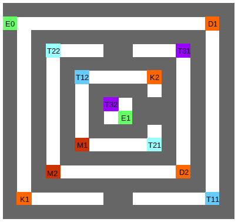

# Maze Runner - Konfiguration #

&nbsp;

## Vorbemerkung ##
In diesem Ordner des Repositorys finden sich sämtliche Dateien, die zur Erstellung einer Konfiguration benötigt werden.

Eine Konfiguration besteht aus einer oder mehreren Levels (sog. stages), die vom Spieler durchlaufen werden müssen. Die Stages wiederum entsprechen einem Objekt der Klasse `Maze` bestehend aus einem `KeyBoard` Objekt (sog. keyboard) für die Belegung der Knöpfe am PewPew Board, einem Labyrinth (sog. maze), einem Läufer (sog. runner) und zwei oder mehr Hindernissen (sog. obstacles).

Ziel des Spiel ist es, einen Weg durch das Labyrinth zu finden und sämtliche Hindernisse zu bewältigen.

&nbsp;

## Codestruktur ##
Die einzelnen Python Module widerspiegeln den logischen Aufbau einer Konfiguration mit:

* _demo\_config.py_: Dieses Modul erstellt eine Instanz der Klasse `Configuration` und fügt die einzelnen Level (d.h. stages) mit der Methode `add( ... )` der Spielkonfiguration in der Reihenfolge von leicht nach schwer hinzu.

* _stage\_0.py_: Diese Datei beinhaltet das leichteste Level und besteht aus einem einfachen 8x8 Labyrinth mit nur einem Ein- und einem Ausgang.

* _stage\_1.py_: Dieses Script konfiguriert das zweite Level des Spiels. Dem einfachen 8x8 Labyrinth aus Stage 0 werden zusätzlich zwei Hindernisse hinzugefügt - ein Schlüssel, welcher zuerst gefunden werden muss, um die verschlossene Türe zu öffnen.

* _stage\_2.py_: Dieses Modul legt das dritte Level fest und besteht aus einem 16x16 Labyrinth mit nur einem Ein- und einem Ausgang. Es soll demonstrieren, welcher Ausschnitt des 16x16 Labyrinths beim Durchlaufen durch den nur 8x8 LED grosse Bildschirm des PewPew Boards angezeigt wird.

* _stage\_3.py_: Dieses Script beschreibt die vierte Stage des Spiels, wobei das gleiche Labyrinth wie in Stage 2 verwendet wurde mit vier zusätzliche Hindernissen - zwei Schlüssel und zwei verschlossene Türen.

* _stage\_4.py_: Das letzte und zugleich schwierigste Level besteht aus einem 16x16 Labyrinth und verschiedensten Hindernissen. Damit soll gezeigt werden, dass auch etwas komplexere Hindernisse wie sog. Teleportationen und sog. Mini Games (d.h. kleine Spiele, die gewonnen werden müssen) in das Labyrinth integriert werden können.

* _snake\_minigame.py_: Diese Modul beinhaltet das Minigame, welches in der Stage 4 verwendet wird. Es handelt sich dabei im Grundsatz um eine objekt-orientierte Kopie des auf dem PewPew Board vorhandenen Spiels 'snake'.

&nbsp;

## Konfiguration Erstellen ##
Das Projekt wurde so programmiert, dass das Erstellen einer eigenen Konfiguration möglichst einfach sein sollte. Welche Dinge es jedoch zu beachten gilt, wird in diesem Abschnitt genauer beschrieben und anhand der Konfiguration von Stage 4 erläutert.

&nbsp;

### Stages Erstellen ###
Um eine eigene Konfiguration erstellen zu können, muss zuerst eine sog. Stage konfiguriert werden. Dazu sind die folgenden Schritte nötig.

1. _Schritt 1 - Modul_: Erstelle eine Python Datei mit beliebigem Namen. Bei Stage 4 wurde bspw. der Name `stage_4.py` verwendet.

2. _Schritt 2 - Import_: Öffne die Datei mit einem Editor und importiere die Module, die für die Konfiguration benötigt werden. Bei Stage 4 musste bspw. neben den nachfolgend genannten Modulen auch noch das Minigame 'Snake' importiert werden.

```python
    from lib.maze      import MazeRunner, Obstacle
    from lib.utilities import KeyBoard, TextPrinter
    ...
```

3. _Schritt 3 - Labyrinth_: Ein Labyrinth wird durch einen zweidimensionalen Array definiert, wobei eine `1` einer Mauer und eine `0` einem begehbaren Pfad entspricht. Es gilt zu beachten, dass das Labyrinth quadratisch und komplett von einer Mauer umgeben sein muss. Als kleine Hilfe kann die im Ordner 'doc' zu findende OpenOffice Datei hinzugezogen werden - die binären Tabellen können als CVS Datei exportiert und zu einem zweidimensionalen Array ergänzt werden. Für die Stage 4 wurde die folgende Tabelle verwendet:


4. _Schritt 4 - Läufer_: Der Läufer entspricht einer Instanz der Klasse `MazeRunner`, wobei als Parameter die x- und y-Position des Läufers übergeben werden kann. Obwohl der Läufer grundsätzlich überall starten kann, dürfte es sinnvoll sein, diesen zu Beginn auf das Hindernis 'Maze Entry' (d.h. Labyrinth Eingang) platzieren. Dazu kann entweder die korrekte Position des Eingangs angegeben werden (vgl. dazu bspw. Stage 4) oder eine beliebige illegale Position (bspw. `MazeRunner(-1, -1)`).

5. _Schritt 5 - Keyboard_: Jede Stage benötigt eine Instanz der Klasse `KeyBoard` und korrekt registrierte Methoden, welche beim Drücken des jeweiligen Knopfes auf dem PewPew Board aufgerufen werden. Grundsätzlich sieht dies für jede Konfiguration gleich aus, d.h. analog zur Stage 4 mit Erstellen eines KeyBoard Objekts und Registrierung der korrekten `walk` Methoden (bspw. `walk_down`) für den korrekten Knopf (bspw. `KeyBoard.KEY_ID_DOWN`) des in Schritt 4 erstellten Läufers:

```python
    s4_keyboard = KeyBoard()
    s4_keyboard.register(KeyBoard.KEY_ID_DOWN, s4_runner.walk_down)
    ...
```

6. _Schritt 6 - Hindernisse_: Zum Schluss sind noch die Hindernisse zu erstellen, wobei die beiden Hindernisse 'Maze Entry' und 'Maze Exit' obligatorisch sind sowie stets am Anfang resp. Ende der Hindernis-Liste (sog. obstacles) stehen müssen. Bis auf die beiden obligatorischen Hindernisse, welche auch auf der Umgebungsmauer liegen dürfen, sind die Hindernisse nur auf den definierten Pfaden (vgl. Labyrinth, Schritt 3) zu positionieren. Um ein Hindernis definieren zu können, muss **(a)** zuerst eine Methode mit beliebigem Namen erstellt werden (sog. challenge), welche aufgerufen wird, wenn der Läufer auf das entsprechende Feld gelangt (vgl. Stage 4 für die Methoden Signatur und die Funktionsweise). **(b)** Sodann wird ein Objekt der Klasse `Obstacle` erstellt und die in (a) erstellte Methode als Parameter beim Hindernis registriert. Als Beispiel wird nachfolgend der Code eines Schlüssel Hindernisses gezeigt und die einzelnen Hindernisse der Stage 4 genauer beschrieben.

```python
    # Methode, die aufgerufen wird, wenn der Laeufer auf das Hindernis
    # trifft - zuerst wird ein Text auf dem 8x8 Display angezeigt und das
    # Hindernis sodann als 'erfuellt' markiert (d.h. der Schlüssel wurde
    # vom Spieler gefunden.
    def o1s4_key_found(caller):
        TextPrinter.print("Key Found")
        caller.fullfill()
    
    # Hindernis an der Position (x=1, y=14) erstellen und die obige
    # Methode registrieren (Achtung: beim Registrieren die runden
    # Klammern immer weg lassen!).
    o1s4_key = Obstacle(1, 14)
    o1s4_key.register(o1s4_key_found)
```

Die Stage 4 Hindernisse sind **(E0)** Labyrinth Eingang (sog. MazeEntry) mit der Methode `maze_entry` und der Position `(0, 1)`; **(K1)** Schlüssel 1 (sog. Key) mit der vorab gescripteten Methode `key_found` und der Position `(1, 14)`; **(D1)** Verschlossene Türe 1 (sog. Door) mit der vorab gescripteten Method `locked_door` - welche die Türe nur öffnet, falls K1 erfüllt ist - und der Position `(14, 1)`; **(T11)** Teleportal (sog. TP) mit der vorab gescripteten Method `teleporter` - welche den Läufer auf T12 versetzt und nicht als erfüllt markiert wird - und der Position `(14, 14)`; **(T12)** Teleportal (sog. TP) mit der vorab gescripteten Method `teleporter` - welche den Läufer auf T11 versetzt und nicht als erfüllt markiert wird - und der Position `(5, 5)`; **(K2)** Schlüssel 2 (sog. Key) mit der vorab gescripteten Methode `key_found` und der Position `(10, 5)`; **(M1)** Mini Challenge (sog. MiniGame) Snake mit der vorab gescripteten Methode `snake` - welche zuerst die neuen Snake Methoden für die Knöpfe registriert, dann das Mini Spiel Snake aufruft und zum Schluss die KeyBoard Knöpfe wieder für die MazeRunner Methoden herstellt -  und der Position `(5, 10)`; **(T21)** Teleportal (sog. TP) mit der vorab gescripteten Method `teleporter` - welche den Läufer auf T22 versetzt und nicht als erfüllt markiert wird - und der Position `(10, 10)`; **(T22)** Teleportal (sog. TP) mit der vorab gescripteten Method `teleporter` - welche den Läufer auf T21 versetzt und nicht als erfüllt markiert wird - und der Position `(3, 3)`; **(M2)** Mini Challenge (sog. MiniGame) Snake mit der vorab gescripteten Methode `snake` - welche zuerst die neuen Snake Methoden für die Knöpfe registriert, dann das Mini Spiel Snake aufruft und zum Schluss die KeyBoard Knöpfe wieder für die MazeRunner Methoden herstellt -  und der Position `(3, 12)`; **(D2)** Verschlossene Türe 2 (sog. Door) mit der vorab gescripteten Method `locked_door` - welche die Türe nur öffnet, falls K2 erfüllt ist - und der Position `(12, 12)`; **(T31)** Teleportal (sog. TP) mit der vorab gescripteten Method `teleporter` - welche den Läufer auf T32 versetzt und nicht als erfüllt markiert wird - und der Position `(12, 3)`; **(T32)** Teleportal (sog. TP) mit der vorab gescripteten Method `teleporter` - welche den Läufer auf T31 versetzt und nicht als erfüllt markiert wird - und der Position `(7, 7)`; **(E1)** Labyrinth Ausgang (sog. MazeExit) mit der Methode `maze_exit` und der Position `(8, 8)`.



&nbsp;

### Configuration Erstellen ###
Sobald alle Stages erstellt wurden, kann die eigentliche Konfiguration erstellt werden. Dazu sind die folgenden Schritte nötig:

1. _Schritt 1 - Modul_: Erstelle eine Python Datei mit beliebigem Namen. Für die aktuelle Konfiguration wurde `demo_config.py` verwendet

2. _Schritt 2 - Import_: Öffne die Datei mit einem Editor und importiere die Module, die für die Konfiguration benötigt werden. Bei der aktuellen Konfiguration zählen dazu die Klasse `Configuration`und die verwendeten Stages.

```python
    from lib.game import Configuration

    from config.stage_0 import *
    from config.stage_1 import *
    ...
```

3. _Schritt 3 - Stage_:  Im letzten Schritt muss nur noch ein Objekt der Klasse `Configuration` erstellt und die Stages in der richtigen Reihenfolge zur Spiel Konfiguration hinzugefügt werden mit:

```python
    configuration = Configuration()
    
    configuration.add(s0_maze, s0_runner, s0_obstacles, s0_keyboard)
    configuration.add(s1_maze, s1_runner, s1_obstacles, s1_keyboard)
    ...
```

&nbsp;

### Hauptmodul Anpassen ###
Zum Schluss muss noch das Hauptmodul `maze_runner.py` angepasst werden, so dass die neue Konfiguration auch geladen wird. Dazu muss die Zeile 3 mit den in den vorangegangenen Schritten gewählten Bezeichner angepasst werden - für die Demo Konfiguration mit:

```python
    ...
    from config.demo_config import configuration
    ...
```

&nbsp;

